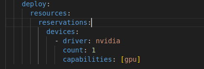
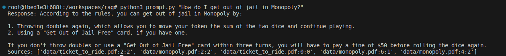
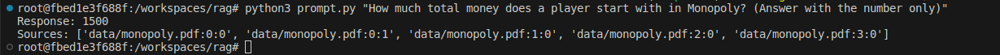

# Tutorial sobre RAG em Python com LLM local
## IA com seus PDFs

Esse tutorial visa facilitar o ambiente de desenvolvimento de soluções com Inteligência Artificial com modelos executados localmente.

Utilizaremos as seguintes tecnologias:
- [Ollama](https://ollama.com/)
- [Docker](https://code.visualstudio.com/docs/devcontainers/containers)
- [Devcontainer](https://code.visualstudio.com/docs/devcontainers/containers)
- [LangChain](https://www.langchain.com/)
- VSCODE com a extensão [Dev Containers](https://marketplace.visualstudio.com/items?itemName=ms-vscode-remote.remote-containers)
- Modelo [llama3](https://llama.meta.com/llama3/) da Meta
- Modelo [nomic-embed-text](https://docs.nomic.ai/reference/endpoints/nomic-embed-text#:~:text=Nomic%20Text%20Embeddings%20allow%20you,and%20use%20them%20in%20Python.) utilizado para criação dos Embeddings


## Nvidia GPU

### Instalando o NVIDIA Container Toolkit
1 - Configure o repositório
```
curl -fsSL https://nvidia.github.io/libnvidia-container/gpgkey \
    | sudo gpg --dearmor -o /usr/share/keyrings/nvidia-container-toolkit-keyring.gpg
curl -s -L https://nvidia.github.io/libnvidia-container/stable/deb/nvidia-container-toolkit.list \
    | sed 's#deb https://#deb [signed-by=/usr/share/keyrings/nvidia-container-toolkit-keyring.gpg] https://#g' \
    | sudo tee /etc/apt/sources.list.d/nvidia-container-toolkit.list
sudo apt-get update

```
2 - Instale o Nvidia Container Toolkit packages

```
sudo apt-get install -y nvidia-container-toolkit
```

3 - Configurar o Docker para usar o driver da Nvidia
```
sudo nvidia-ctk runtime configure --runtime=docker
sudo systemctl restart docker
```


## Ambiente

Clonar o projeto de:
```
git clone https://github.com/rodrigoaustincascao/rag_with_ollama.git
```
entrar no diretório:
```
cd rag_with_ollama
```

Caso NÃO tenha uma placa de vídeo NVIDIA é necessário comentar estre trecho no `docker-compose.yaml`.



Abrir o projeto com o VSCODE e precionar `CRTL` + `SHIFT` + `P` e selecionar a opção `Reopen in Container`

Após inicializar os container, é necessário realizar o download dos Modelos llama3 e do nomic-embed-text. 
Para o download do llama3 que possui aproximadamente 4.7Gb, execute:
```
docker exec -it ollama ollama run llama3
```
Para o download do nomic-embed-text, que possui aproximadamente 300mb, execute:
```
docker exec -it ollama ollama run nomic-embed-text
```

Caso queira uma interface para interagir com o modelo, acesse [localhost:8666](localhost:8666). É necessário, no primeiro acesso, cadastrar um usuário com `nome`, `email` e `senha`.


<!-- No primeiro acesso, é necessário definir a conexão com o modelo. Para isso, acesse `Settings`=> `Connections` e em `Ollama Base URL` definia a URL como `http://ollama:11434`. -->


## Utilização
O projeto já foi carregado com o Modelo llama3 da Meta. Para esse exemplo o modelo foi treinado com os manuais do Monopoly e do Ticket to Ride.

### Treinamento
Para treinar o modelo os PDFs devem estar na pasta `data` e deve executar o script `importar_pdf.py`. Após o início da execução, vá tomar um café :coffee: , pois vai demorar um pouco! :smile:
```
python3 importar_pdf.py
```
O script realizará a importação dos pdfs. Esses serão divididos em pedaços menores, será gerao os Embeddings e adicionados no Banco de Dados de vetor (Chroma). 

### Consulta
Para realizar uma consulta é necessário realizar executar o script `prompt.py` passando como argumento a pergunta.

```
python3 prompt.py "How do I get out of jail in Monopoly?"
```
Como saída teremos a resposta e as fontes, informando em qual arquivo:página:index está localizado o contexto.

#### Funcionamento da consulta
Quando uma pergunta é realizada, o sistema vai ao banco de vetores e retorna os trechos relacionados. Para esse exemplo usamos `k=5`, que indica que serão retornados 5 trechos relacionados. Com esses trechos em mãos, eles são enviados ao modelo selecionado para que gere uma resposta mais estruturada. Essa resposta é composta pela resposta e as fontes.





## Validando as respostas
Para validar as resposta, são utilizados testes unitários. Que consistem em validar as respostas previamente definidas.
Como as respostas do modelo não seguem um padrão, a ideia é submeter a resposta do modelo ao próprio modelo, junto com a resposta esperada, para verificar de forma boleana se está correta ou não.
Para executar os teste:
```
pytest
```
